<!-- README.md is generated from README.Rmd. Please edit that file -->

# R workflow for Simple Spatial Surveys Method (S3M) survey in Mozambique

<!-- badges: start -->

[](https://github.com/katilingban/mozambique_s3m/actions/workflows/test-s3m-workflow.yaml)
[](https://github.com/katilingban/mozambique-s3m/actions/workflows/check-s3m-data.yaml)
<!-- badges: end -->

This repository is a
[`docker`](https://www.docker.com/get-started)-containerised,
[`{targets}`](https://docs.ropensci.org/targets/)-based,
[`{renv}`](https://rstudio.github.io/renv/articles/renv.html)-enabled
[`R`](https://cran.r-project.org/) workflow developed for the design,
data management, data analysis, and reporting of the implementation of
Simple Spatial Surveys Method (S3M) survey in Mozambique.

## Repository Structure

- `data/` contains intermediate data outputs produced by the workflow
  including a survey codebook describing all variables;
- `R/` contains functions created for use in this workflow;
- `reports/` contains literate code for R Markdown reports generated in
  the workflow;
- `outputs/` contains compiled reports and figures;
- `auth/` contains credentials for Google service account (see below for
  more information);
- `docs/` contains archived high frequency data checks reports produced
  during the implementation of the survey;
- `_targets.R` file defines the steps in this workflow’s data management
  and analysis pipeline.

## Reproducibility

### R package dependencies

This project requires `R 4.2.2 Patched (2022-11-10 r83330)`. This
project uses the `{renv}` framework to record R package dependencies and
versions. Packages and versions used are recorded in renv.lock and code
used to manage dependencies is in renv/ and other files in the root
project directory. On starting an R session in the working directory,
`run renv::restore()` to install R package dependencies.

### Data management and analysis

This project uses the targets package to create its data management and
analysis pipeline as defined in the `_targets.R` file.

- To execute the data management and processing workflow, run:

<!-- -->

    targets::tar_make(recoded_data)

The schematic figure below summarizes the steps in the data management
and processing workflow:

✓ Successfully auto-authenticated via
auth/mozambique-s3m-e9da207bc2a3.json



``` mermaid
graph LR
  subgraph legend
    x7420bd9270f8d27d([""Up to date""]):::uptodate --- xbf4603d6c2c2ad6b([""Stem""]):::none
  end
  subgraph Graph
    x09e58614f2343db8(["raw_data_clean"]):::uptodate --> x496492de0126f151(["fies_recoded_data"]):::uptodate
    x09e58614f2343db8(["raw_data_clean"]):::uptodate --> x3c8b244f6e4168fe(["ccare_recoded_data"]):::uptodate
    x09e58614f2343db8(["raw_data_clean"]):::uptodate --> xc73a432062a11eb6(["dev_recoded_data"]):::uptodate
    x09e58614f2343db8(["raw_data_clean"]):::uptodate --> x1f3fecfd1ca845bd(["fever_recoded_data"]):::uptodate
    xfcfc1959dbba8ed3(["survey_codebook"]):::uptodate --> x7c4bd58b32757fee(["bf_vars_map"]):::uptodate
    xa8e340faedc4bac3(["asset_recoded_data"]):::uptodate --> x1d7f90e55334d387(["recoded_data"]):::uptodate
    xc943e53a635cbb7b(["association_recoded_data"]):::uptodate --> x1d7f90e55334d387(["recoded_data"]):::uptodate
    xd831b62b505bd4db(["bf_recoded_data"]):::uptodate --> x1d7f90e55334d387(["recoded_data"]):::uptodate
    x742c27f76ddb40b7(["carer_recoded_data"]):::uptodate --> x1d7f90e55334d387(["recoded_data"]):::uptodate
    x3c8b244f6e4168fe(["ccare_recoded_data"]):::uptodate --> x1d7f90e55334d387(["recoded_data"]):::uptodate
    x112bc6f3c5f9d9ce(["child_anthro_recoded_data"]):::uptodate --> x1d7f90e55334d387(["recoded_data"]):::uptodate
    xc73a432062a11eb6(["dev_recoded_data"]):::uptodate --> x1d7f90e55334d387(["recoded_data"]):::uptodate
    x367849809100f60a(["diarrhoea_recoded_data"]):::uptodate --> x1d7f90e55334d387(["recoded_data"]):::uptodate
    x710620555a048954(["fcs_recoded_data"]):::uptodate --> x1d7f90e55334d387(["recoded_data"]):::uptodate
    x1f3fecfd1ca845bd(["fever_recoded_data"]):::uptodate --> x1d7f90e55334d387(["recoded_data"]):::uptodate
    x30fed1dc686e3b12(["fg_recoded_data"]):::uptodate --> x1d7f90e55334d387(["recoded_data"]):::uptodate
    x496492de0126f151(["fies_recoded_data"]):::uptodate --> x1d7f90e55334d387(["recoded_data"]):::uptodate
    xe682849197bae083(["fp_recoded_data"]):::uptodate --> x1d7f90e55334d387(["recoded_data"]):::uptodate
    x5f4e9e79af1e1472(["hdds_recoded_data"]):::uptodate --> x1d7f90e55334d387(["recoded_data"]):::uptodate
    xf758240a3e7b1819(["house_recoded_data"]):::uptodate --> x1d7f90e55334d387(["recoded_data"]):::uptodate
    xec89fa2c537264a9(["hygiene_recoded_data"]):::uptodate --> x1d7f90e55334d387(["recoded_data"]):::uptodate
    x4886c91a92173c33(["imm_recoded_data"]):::uptodate --> x1d7f90e55334d387(["recoded_data"]):::uptodate
    x60b2202dd48c4187(["iycf_recoded_data"]):::uptodate --> x1d7f90e55334d387(["recoded_data"]):::uptodate
    x1bfdb340aaf51c10(["lcsi_recoded_data"]):::uptodate --> x1d7f90e55334d387(["recoded_data"]):::uptodate
    xaf0c296cd393c60a(["mddw_recoded_data"]):::uptodate --> x1d7f90e55334d387(["recoded_data"]):::uptodate
    x4d8046cea91f9b56(["meal_recoded_data"]):::uptodate --> x1d7f90e55334d387(["recoded_data"]):::uptodate
    xea05af72157b0fb1(["mother_anthro_recoded_data"]):::uptodate --> x1d7f90e55334d387(["recoded_data"]):::uptodate
    x5945d6cfa2871f2c(["nc_recoded_data"]):::uptodate --> x1d7f90e55334d387(["recoded_data"]):::uptodate
    xca59fbabd3e982fd(["net_recoded_data"]):::uptodate --> x1d7f90e55334d387(["recoded_data"]):::uptodate
    xfbe1be7fbc5dc84a(["phq_recoded_data"]):::uptodate --> x1d7f90e55334d387(["recoded_data"]):::uptodate
    xb4b09a3b00ca06ba(["pica_recoded_data"]):::uptodate --> x1d7f90e55334d387(["recoded_data"]):::uptodate
    xfb6b83f1bca73d99(["play_recoded_data"]):::uptodate --> x1d7f90e55334d387(["recoded_data"]):::uptodate
    xc6d4db57e4eda930(["pmtct_recoded_data"]):::uptodate --> x1d7f90e55334d387(["recoded_data"]):::uptodate
    x10fa88c49bbafc11(["pnet_recoded_data"]):::uptodate --> x1d7f90e55334d387(["recoded_data"]):::uptodate
    xa3d477de8edf7304(["preg_recoded_data"]):::uptodate --> x1d7f90e55334d387(["recoded_data"]):::uptodate
    x9db0983be8f9a87e(["rcsi_recoded_data"]):::uptodate --> x1d7f90e55334d387(["recoded_data"]):::uptodate
    x2db338587fbf37d4(["rh_recoded_data"]):::uptodate --> x1d7f90e55334d387(["recoded_data"]):::uptodate
    x3fba54c49f8f16c2(["rti_recoded_data"]):::uptodate --> x1d7f90e55334d387(["recoded_data"]):::uptodate
    x9aa4a08a3d96ba04(["san_recoded_data"]):::uptodate --> x1d7f90e55334d387(["recoded_data"]):::uptodate
    xe30a779c94007481(["stock_recoded_data"]):::uptodate --> x1d7f90e55334d387(["recoded_data"]):::uptodate
    xbdf2197d4c2cc451(["travel_recoded_data"]):::uptodate --> x1d7f90e55334d387(["recoded_data"]):::uptodate
    x1dccf1efe1fe8a59(["vas_recoded_data"]):::uptodate --> x1d7f90e55334d387(["recoded_data"]):::uptodate
    xc50f600622405cc8(["water_recoded_data"]):::uptodate --> x1d7f90e55334d387(["recoded_data"]):::uptodate
    x89dfb95fe8e44cfd(["wdds_recoded_data"]):::uptodate --> x1d7f90e55334d387(["recoded_data"]):::uptodate
    x8ace7508ee23a746(["wem_recoded_data"]):::uptodate --> x1d7f90e55334d387(["recoded_data"]):::uptodate
    x09f7a2f0356d4d1e(["work_recoded_data"]):::uptodate --> x1d7f90e55334d387(["recoded_data"]):::uptodate
    x09e58614f2343db8(["raw_data_clean"]):::uptodate --> xb4b09a3b00ca06ba(["pica_recoded_data"]):::uptodate
    x09e58614f2343db8(["raw_data_clean"]):::uptodate --> x8ace7508ee23a746(["wem_recoded_data"]):::uptodate
    x09e58614f2343db8(["raw_data_clean"]):::uptodate --> x2db338587fbf37d4(["rh_recoded_data"]):::uptodate
    x09e58614f2343db8(["raw_data_clean"]):::uptodate --> xbdf2197d4c2cc451(["travel_recoded_data"]):::uptodate
    x5fca5365e0e37178(["raw_data_clean_translated"]):::uptodate --> xe682849197bae083(["fp_recoded_data"]):::uptodate
    x09e58614f2343db8(["raw_data_clean"]):::uptodate --> x9aa4a08a3d96ba04(["san_recoded_data"]):::uptodate
    x09e58614f2343db8(["raw_data_clean"]):::uptodate --> x3fba54c49f8f16c2(["rti_recoded_data"]):::uptodate
    x09e58614f2343db8(["raw_data_clean"]):::uptodate --> xf758240a3e7b1819(["house_recoded_data"]):::uptodate
    x99f2e87c4ca71416(["sofala_ea_population_pdf_data"]):::uptodate --> x93aca45d8ff2a04c(["sofala_ea_population"]):::uptodate
    xb8a1b385028f22b2(["sofala_ea_population_pdf_text"]):::uptodate --> x93aca45d8ff2a04c(["sofala_ea_population"]):::uptodate
    xcf59fc858ba254c4(["mddw_vars_map"]):::uptodate --> xaf0c296cd393c60a(["mddw_recoded_data"]):::uptodate
    x09e58614f2343db8(["raw_data_clean"]):::uptodate --> xaf0c296cd393c60a(["mddw_recoded_data"]):::uptodate
    x4929560ad38c727a(["fg_vars_map"]):::uptodate --> x30fed1dc686e3b12(["fg_recoded_data"]):::uptodate
    x09e58614f2343db8(["raw_data_clean"]):::uptodate --> x30fed1dc686e3b12(["fg_recoded_data"]):::uptodate
    x7c4bd58b32757fee(["bf_vars_map"]):::uptodate --> xd831b62b505bd4db(["bf_recoded_data"]):::uptodate
    x09e58614f2343db8(["raw_data_clean"]):::uptodate --> xd831b62b505bd4db(["bf_recoded_data"]):::uptodate
    x09e58614f2343db8(["raw_data_clean"]):::uptodate --> x4886c91a92173c33(["imm_recoded_data"]):::uptodate
    x09e58614f2343db8(["raw_data_clean"]):::uptodate --> x9db0983be8f9a87e(["rcsi_recoded_data"]):::uptodate
    x09e58614f2343db8(["raw_data_clean"]):::uptodate --> xec89fa2c537264a9(["hygiene_recoded_data"]):::uptodate
    x09e58614f2343db8(["raw_data_clean"]):::uptodate --> x5fca5365e0e37178(["raw_data_clean_translated"]):::uptodate
    x09e58614f2343db8(["raw_data_clean"]):::uptodate --> xfbe1be7fbc5dc84a(["phq_recoded_data"]):::uptodate
    x09e58614f2343db8(["raw_data_clean"]):::uptodate --> xa8e340faedc4bac3(["asset_recoded_data"]):::uptodate
    x09e58614f2343db8(["raw_data_clean"]):::uptodate --> xca59fbabd3e982fd(["net_recoded_data"]):::uptodate
    x5cb38595d014940f(["sofala_district_population_pdf"]):::uptodate --> xa4fd78014394f719(["sofala_district_population"]):::uptodate
    x09e58614f2343db8(["raw_data_clean"]):::uptodate --> xe30a779c94007481(["stock_recoded_data"]):::uptodate
    x09e58614f2343db8(["raw_data_clean"]):::uptodate --> xea05af72157b0fb1(["mother_anthro_recoded_data"]):::uptodate
    x09e58614f2343db8(["raw_data_clean"]):::uptodate --> x1bfdb340aaf51c10(["lcsi_recoded_data"]):::uptodate
    x52eeb21c389d52d8(["sofala_xlsform_file"]):::uptodate --> x0c65864d89dfd824(["survey_questions"]):::uptodate
    x0c65864d89dfd824(["survey_questions"]):::uptodate --> x136e4e85e6851637(["raw_data"]):::uptodate
    x09e58614f2343db8(["raw_data_clean"]):::uptodate --> xfb6b83f1bca73d99(["play_recoded_data"]):::uptodate
    x136e4e85e6851637(["raw_data"]):::uptodate --> x09e58614f2343db8(["raw_data_clean"]):::uptodate
    xfcfc1959dbba8ed3(["survey_codebook"]):::uptodate --> x09e58614f2343db8(["raw_data_clean"]):::uptodate
    x0c65864d89dfd824(["survey_questions"]):::uptodate --> x09e58614f2343db8(["raw_data_clean"]):::uptodate
    x09e58614f2343db8(["raw_data_clean"]):::uptodate --> x742c27f76ddb40b7(["carer_recoded_data"]):::uptodate
    xd831b62b505bd4db(["bf_recoded_data"]):::uptodate --> x60b2202dd48c4187(["iycf_recoded_data"]):::uptodate
    x30fed1dc686e3b12(["fg_recoded_data"]):::uptodate --> x60b2202dd48c4187(["iycf_recoded_data"]):::uptodate
    x4d8046cea91f9b56(["meal_recoded_data"]):::uptodate --> x60b2202dd48c4187(["iycf_recoded_data"]):::uptodate
    x09e58614f2343db8(["raw_data_clean"]):::uptodate --> x60b2202dd48c4187(["iycf_recoded_data"]):::uptodate
    x09e58614f2343db8(["raw_data_clean"]):::uptodate --> x4d8046cea91f9b56(["meal_recoded_data"]):::uptodate
    x09e58614f2343db8(["raw_data_clean"]):::uptodate --> x1dccf1efe1fe8a59(["vas_recoded_data"]):::uptodate
    x09e58614f2343db8(["raw_data_clean"]):::uptodate --> x112bc6f3c5f9d9ce(["child_anthro_recoded_data"]):::uptodate
    x09e58614f2343db8(["raw_data_clean"]):::uptodate --> xc6d4db57e4eda930(["pmtct_recoded_data"]):::uptodate
    x52eeb21c389d52d8(["sofala_xlsform_file"]):::uptodate --> x5aed27afbde18e19(["survey_choices"]):::uptodate
    xd946f9fb4faff97c(["hdds_vars_map"]):::uptodate --> x5f4e9e79af1e1472(["hdds_recoded_data"]):::uptodate
    x09e58614f2343db8(["raw_data_clean"]):::uptodate --> x5f4e9e79af1e1472(["hdds_recoded_data"]):::uptodate
    x09e58614f2343db8(["raw_data_clean"]):::uptodate --> x367849809100f60a(["diarrhoea_recoded_data"]):::uptodate
    x09e58614f2343db8(["raw_data_clean"]):::uptodate --> x10fa88c49bbafc11(["pnet_recoded_data"]):::uptodate
    x09e58614f2343db8(["raw_data_clean"]):::uptodate --> xc50f600622405cc8(["water_recoded_data"]):::uptodate
    x136e4e85e6851637(["raw_data"]):::uptodate --> xfcfc1959dbba8ed3(["survey_codebook"]):::uptodate
    x5aed27afbde18e19(["survey_choices"]):::uptodate --> xfcfc1959dbba8ed3(["survey_codebook"]):::uptodate
    x0c65864d89dfd824(["survey_questions"]):::uptodate --> xfcfc1959dbba8ed3(["survey_codebook"]):::uptodate
    x09e58614f2343db8(["raw_data_clean"]):::uptodate --> xa3d477de8edf7304(["preg_recoded_data"]):::uptodate
    x09e58614f2343db8(["raw_data_clean"]):::uptodate --> x89dfb95fe8e44cfd(["wdds_recoded_data"]):::uptodate
    xf222f81b7d734901(["wdds_vars_map"]):::uptodate --> x89dfb95fe8e44cfd(["wdds_recoded_data"]):::uptodate
    x09e58614f2343db8(["raw_data_clean"]):::uptodate --> xc943e53a635cbb7b(["association_recoded_data"]):::uptodate
    x09e58614f2343db8(["raw_data_clean"]):::uptodate --> x09f7a2f0356d4d1e(["work_recoded_data"]):::uptodate
    x09e58614f2343db8(["raw_data_clean"]):::uptodate --> x5945d6cfa2871f2c(["nc_recoded_data"]):::uptodate
    x6d5a6a038d8cf062(["fcs_vars_map"]):::uptodate --> x710620555a048954(["fcs_recoded_data"]):::uptodate
    x09e58614f2343db8(["raw_data_clean"]):::uptodate --> x710620555a048954(["fcs_recoded_data"]):::uptodate
  end
  classDef uptodate stroke:#000000,color:#ffffff,fill:#354823;
  classDef none stroke:#000000,color:#000000,fill:#94a4ac;
  linkStyle 0 stroke-width:0px;
```

- To execute the data analysis workflow, run:

<!-- -->

    targets::tar_make(indicator_results_districts_xlsx)
    targets::tar_make(indicator_results_overall_xlsx)
    targets::tar_make(dplyr::contains("interpolation_maps"))
    targets::tar_make(dplyr::contains("choropleth_maps"))

The schematic figure below summarizes the steps in the data management
and processing workflow:

✓ Successfully auto-authenticated via
auth/mozambique-s3m-e9da207bc2a3.json

``` mermaid
graph LR
  subgraph legend
    x7420bd9270f8d27d([""Up to date""]):::uptodate --- x0a52b03877696646([""Outdated""]):::outdated
    x0a52b03877696646([""Outdated""]):::outdated --- xbf4603d6c2c2ad6b([""Stem""]):::none
  end
  subgraph Graph
    x422429678da8ef54(["bootstrap_household_indicators"]):::uptodate --> x755099e128319319(["household_indicators_results_table"]):::uptodate
    xffb1cbdd239887a8(["bootstrap_woman_indicators"]):::uptodate --> xff4bee8bbfcecb5b(["woman_indicators_map_table"]):::uptodate
    x09e58614f2343db8(["raw_data_clean"]):::uptodate --> x496492de0126f151(["fies_recoded_data"]):::uptodate
    x09e58614f2343db8(["raw_data_clean"]):::uptodate --> x3c8b244f6e4168fe(["ccare_recoded_data"]):::uptodate
    x09e58614f2343db8(["raw_data_clean"]):::uptodate --> xc73a432062a11eb6(["dev_recoded_data"]):::uptodate
    x09e58614f2343db8(["raw_data_clean"]):::uptodate --> x1f3fecfd1ca845bd(["fever_recoded_data"]):::uptodate
    xfcfc1959dbba8ed3(["survey_codebook"]):::uptodate --> x7c4bd58b32757fee(["bf_vars_map"]):::uptodate
    xbc350440e54388cd(["sofala_int_grid"]):::uptodate --> xfbc24a27b1a60d09(["sofala_int_points"]):::uptodate
    xa8e340faedc4bac3(["asset_recoded_data"]):::uptodate --> x1d7f90e55334d387(["recoded_data"]):::uptodate
    xc943e53a635cbb7b(["association_recoded_data"]):::uptodate --> x1d7f90e55334d387(["recoded_data"]):::uptodate
    xd831b62b505bd4db(["bf_recoded_data"]):::uptodate --> x1d7f90e55334d387(["recoded_data"]):::uptodate
    x742c27f76ddb40b7(["carer_recoded_data"]):::uptodate --> x1d7f90e55334d387(["recoded_data"]):::uptodate
    x3c8b244f6e4168fe(["ccare_recoded_data"]):::uptodate --> x1d7f90e55334d387(["recoded_data"]):::uptodate
    x112bc6f3c5f9d9ce(["child_anthro_recoded_data"]):::uptodate --> x1d7f90e55334d387(["recoded_data"]):::uptodate
    xc73a432062a11eb6(["dev_recoded_data"]):::uptodate --> x1d7f90e55334d387(["recoded_data"]):::uptodate
    x367849809100f60a(["diarrhoea_recoded_data"]):::uptodate --> x1d7f90e55334d387(["recoded_data"]):::uptodate
    x710620555a048954(["fcs_recoded_data"]):::uptodate --> x1d7f90e55334d387(["recoded_data"]):::uptodate
    x1f3fecfd1ca845bd(["fever_recoded_data"]):::uptodate --> x1d7f90e55334d387(["recoded_data"]):::uptodate
    x30fed1dc686e3b12(["fg_recoded_data"]):::uptodate --> x1d7f90e55334d387(["recoded_data"]):::uptodate
    x496492de0126f151(["fies_recoded_data"]):::uptodate --> x1d7f90e55334d387(["recoded_data"]):::uptodate
    xe682849197bae083(["fp_recoded_data"]):::uptodate --> x1d7f90e55334d387(["recoded_data"]):::uptodate
    x5f4e9e79af1e1472(["hdds_recoded_data"]):::uptodate --> x1d7f90e55334d387(["recoded_data"]):::uptodate
    xf758240a3e7b1819(["house_recoded_data"]):::uptodate --> x1d7f90e55334d387(["recoded_data"]):::uptodate
    xec89fa2c537264a9(["hygiene_recoded_data"]):::uptodate --> x1d7f90e55334d387(["recoded_data"]):::uptodate
    x4886c91a92173c33(["imm_recoded_data"]):::uptodate --> x1d7f90e55334d387(["recoded_data"]):::uptodate
    x60b2202dd48c4187(["iycf_recoded_data"]):::uptodate --> x1d7f90e55334d387(["recoded_data"]):::uptodate
    x1bfdb340aaf51c10(["lcsi_recoded_data"]):::uptodate --> x1d7f90e55334d387(["recoded_data"]):::uptodate
    xaf0c296cd393c60a(["mddw_recoded_data"]):::uptodate --> x1d7f90e55334d387(["recoded_data"]):::uptodate
    x4d8046cea91f9b56(["meal_recoded_data"]):::uptodate --> x1d7f90e55334d387(["recoded_data"]):::uptodate
    xea05af72157b0fb1(["mother_anthro_recoded_data"]):::uptodate --> x1d7f90e55334d387(["recoded_data"]):::uptodate
    x5945d6cfa2871f2c(["nc_recoded_data"]):::uptodate --> x1d7f90e55334d387(["recoded_data"]):::uptodate
    xca59fbabd3e982fd(["net_recoded_data"]):::uptodate --> x1d7f90e55334d387(["recoded_data"]):::uptodate
    xfbe1be7fbc5dc84a(["phq_recoded_data"]):::uptodate --> x1d7f90e55334d387(["recoded_data"]):::uptodate
    xb4b09a3b00ca06ba(["pica_recoded_data"]):::uptodate --> x1d7f90e55334d387(["recoded_data"]):::uptodate
    xfb6b83f1bca73d99(["play_recoded_data"]):::uptodate --> x1d7f90e55334d387(["recoded_data"]):::uptodate
    xc6d4db57e4eda930(["pmtct_recoded_data"]):::uptodate --> x1d7f90e55334d387(["recoded_data"]):::uptodate
    x10fa88c49bbafc11(["pnet_recoded_data"]):::uptodate --> x1d7f90e55334d387(["recoded_data"]):::uptodate
    xa3d477de8edf7304(["preg_recoded_data"]):::uptodate --> x1d7f90e55334d387(["recoded_data"]):::uptodate
    x9db0983be8f9a87e(["rcsi_recoded_data"]):::uptodate --> x1d7f90e55334d387(["recoded_data"]):::uptodate
    x2db338587fbf37d4(["rh_recoded_data"]):::uptodate --> x1d7f90e55334d387(["recoded_data"]):::uptodate
    x3fba54c49f8f16c2(["rti_recoded_data"]):::uptodate --> x1d7f90e55334d387(["recoded_data"]):::uptodate
    x9aa4a08a3d96ba04(["san_recoded_data"]):::uptodate --> x1d7f90e55334d387(["recoded_data"]):::uptodate
    xe30a779c94007481(["stock_recoded_data"]):::uptodate --> x1d7f90e55334d387(["recoded_data"]):::uptodate
    xbdf2197d4c2cc451(["travel_recoded_data"]):::uptodate --> x1d7f90e55334d387(["recoded_data"]):::uptodate
    x1dccf1efe1fe8a59(["vas_recoded_data"]):::uptodate --> x1d7f90e55334d387(["recoded_data"]):::uptodate
    xc50f600622405cc8(["water_recoded_data"]):::uptodate --> x1d7f90e55334d387(["recoded_data"]):::uptodate
    x89dfb95fe8e44cfd(["wdds_recoded_data"]):::uptodate --> x1d7f90e55334d387(["recoded_data"]):::uptodate
    x8ace7508ee23a746(["wem_recoded_data"]):::uptodate --> x1d7f90e55334d387(["recoded_data"]):::uptodate
    x09f7a2f0356d4d1e(["work_recoded_data"]):::uptodate --> x1d7f90e55334d387(["recoded_data"]):::uptodate
    x09e58614f2343db8(["raw_data_clean"]):::uptodate --> xb4b09a3b00ca06ba(["pica_recoded_data"]):::uptodate
    x23106db682483953(["household_indicators_list"]):::uptodate --> x226eb16a93f8b80f(["interpolation_household_indicators"]):::outdated
    xa165de387e54dd5b(["recoded_data_sf"]):::uptodate --> x226eb16a93f8b80f(["interpolation_household_indicators"]):::outdated
    xfbc24a27b1a60d09(["sofala_int_points"]):::uptodate --> x226eb16a93f8b80f(["interpolation_household_indicators"]):::outdated
    x09e58614f2343db8(["raw_data_clean"]):::uptodate --> x8ace7508ee23a746(["wem_recoded_data"]):::uptodate
    x1d7f90e55334d387(["recoded_data"]):::uptodate --> x7fef4ef2a727cf52(["bootstrap_stunting_probit_indicators"]):::uptodate
    x93aca45d8ff2a04c(["sofala_ea_population"]):::uptodate --> x7fef4ef2a727cf52(["bootstrap_stunting_probit_indicators"]):::uptodate
    x09e58614f2343db8(["raw_data_clean"]):::uptodate --> x2db338587fbf37d4(["rh_recoded_data"]):::uptodate
    x1d7f90e55334d387(["recoded_data"]):::uptodate --> xa165de387e54dd5b(["recoded_data_sf"]):::uptodate
    x0422c671cabacc30(["child_indicators_list"]):::uptodate --> x0ad37fd80a04a39f(["child_interpolation_maps"]):::uptodate
    x5f558ca65fa02e9a(["interpolation_child_indicators"]):::uptodate --> x0ad37fd80a04a39f(["child_interpolation_maps"]):::uptodate
    x89b92e016b1a0789(["sofala_province"]):::uptodate --> x0ad37fd80a04a39f(["child_interpolation_maps"]):::uptodate
    x09e58614f2343db8(["raw_data_clean"]):::uptodate --> xbdf2197d4c2cc451(["travel_recoded_data"]):::uptodate
    xba13b3c9c5628119(["bootstrap_carer_indicators"]):::uptodate --> x5cd509068514069e(["province_carer_indicators"]):::uptodate
    xa4fd78014394f719(["sofala_district_population"]):::uptodate --> x5cd509068514069e(["province_carer_indicators"]):::uptodate
    x5fca5365e0e37178(["raw_data_clean_translated"]):::uptodate --> xe682849197bae083(["fp_recoded_data"]):::uptodate
    x09e58614f2343db8(["raw_data_clean"]):::uptodate --> x9aa4a08a3d96ba04(["san_recoded_data"]):::uptodate
    x1d7f90e55334d387(["recoded_data"]):::uptodate --> xf813b62b67693ca5(["bootstrap_muac_probit_indicators"]):::uptodate
    x93aca45d8ff2a04c(["sofala_ea_population"]):::uptodate --> xf813b62b67693ca5(["bootstrap_muac_probit_indicators"]):::uptodate
    x04e061bbe4548195(["carer_indicators_list"]):::uptodate --> x4824f2aa631d11ac(["interpolation_carer_indicators"]):::outdated
    xa165de387e54dd5b(["recoded_data_sf"]):::uptodate --> x4824f2aa631d11ac(["interpolation_carer_indicators"]):::outdated
    xfbc24a27b1a60d09(["sofala_int_points"]):::uptodate --> x4824f2aa631d11ac(["interpolation_carer_indicators"]):::outdated
    x23106db682483953(["household_indicators_list"]):::uptodate --> x422429678da8ef54(["bootstrap_household_indicators"]):::uptodate
    x1d7f90e55334d387(["recoded_data"]):::uptodate --> x422429678da8ef54(["bootstrap_household_indicators"]):::uptodate
    x93aca45d8ff2a04c(["sofala_ea_population"]):::uptodate --> x422429678da8ef54(["bootstrap_household_indicators"]):::uptodate
    x09e58614f2343db8(["raw_data_clean"]):::uptodate --> x3fba54c49f8f16c2(["rti_recoded_data"]):::uptodate
    x422429678da8ef54(["bootstrap_household_indicators"]):::uptodate --> x2453797bf6de6781(["household_indicators_map_table"]):::uptodate
    x09e58614f2343db8(["raw_data_clean"]):::uptodate --> xf758240a3e7b1819(["house_recoded_data"]):::uptodate
    x99f2e87c4ca71416(["sofala_ea_population_pdf_data"]):::uptodate --> x93aca45d8ff2a04c(["sofala_ea_population"]):::uptodate
    xb8a1b385028f22b2(["sofala_ea_population_pdf_text"]):::uptodate --> x93aca45d8ff2a04c(["sofala_ea_population"]):::uptodate
    xcf59fc858ba254c4(["mddw_vars_map"]):::uptodate --> xaf0c296cd393c60a(["mddw_recoded_data"]):::uptodate
    x09e58614f2343db8(["raw_data_clean"]):::uptodate --> xaf0c296cd393c60a(["mddw_recoded_data"]):::uptodate
    x4929560ad38c727a(["fg_vars_map"]):::uptodate --> x30fed1dc686e3b12(["fg_recoded_data"]):::uptodate
    x09e58614f2343db8(["raw_data_clean"]):::uptodate --> x30fed1dc686e3b12(["fg_recoded_data"]):::uptodate
    x05921dbb15d26204(["carer_indicators_results_table"]):::uptodate --> x8aed945226ca21e1(["indicator_results_districts_xlsx"]):::uptodate
    xb814555ba21d9540(["child_anthro_probit_results_table"]):::uptodate --> x8aed945226ca21e1(["indicator_results_districts_xlsx"]):::uptodate
    x95b6d682968907a2(["child_indicators_results_table"]):::uptodate --> x8aed945226ca21e1(["indicator_results_districts_xlsx"]):::uptodate
    x755099e128319319(["household_indicators_results_table"]):::uptodate --> x8aed945226ca21e1(["indicator_results_districts_xlsx"]):::uptodate
    x6ce5a9a76e25e192(["woman_indicators_results_table"]):::uptodate --> x8aed945226ca21e1(["indicator_results_districts_xlsx"]):::uptodate
    x7c4bd58b32757fee(["bf_vars_map"]):::uptodate --> xd831b62b505bd4db(["bf_recoded_data"]):::uptodate
    x09e58614f2343db8(["raw_data_clean"]):::uptodate --> xd831b62b505bd4db(["bf_recoded_data"]):::uptodate
    x09e58614f2343db8(["raw_data_clean"]):::uptodate --> x4886c91a92173c33(["imm_recoded_data"]):::uptodate
    x23106db682483953(["household_indicators_list"]):::uptodate --> xe0aaa472a9729f39(["household_interpolation_maps"]):::outdated
    x226eb16a93f8b80f(["interpolation_household_indicators"]):::outdated --> xe0aaa472a9729f39(["household_interpolation_maps"]):::outdated
    x89b92e016b1a0789(["sofala_province"]):::uptodate --> xe0aaa472a9729f39(["household_interpolation_maps"]):::outdated
    xa165de387e54dd5b(["recoded_data_sf"]):::uptodate --> xc384451fb79c50ba(["interpolation_woman_indicators"]):::outdated
    xfbc24a27b1a60d09(["sofala_int_points"]):::uptodate --> xc384451fb79c50ba(["interpolation_woman_indicators"]):::outdated
    x53ad39b075f2f912(["woman_indicators_list"]):::uptodate --> xc384451fb79c50ba(["interpolation_woman_indicators"]):::outdated
    x09e58614f2343db8(["raw_data_clean"]):::uptodate --> x9db0983be8f9a87e(["rcsi_recoded_data"]):::uptodate
    x09e58614f2343db8(["raw_data_clean"]):::uptodate --> xec89fa2c537264a9(["hygiene_recoded_data"]):::uptodate
    x0422c671cabacc30(["child_indicators_list"]):::uptodate --> x5f558ca65fa02e9a(["interpolation_child_indicators"]):::uptodate
    xa165de387e54dd5b(["recoded_data_sf"]):::uptodate --> x5f558ca65fa02e9a(["interpolation_child_indicators"]):::uptodate
    xfbc24a27b1a60d09(["sofala_int_points"]):::uptodate --> x5f558ca65fa02e9a(["interpolation_child_indicators"]):::uptodate
    x23106db682483953(["household_indicators_list"]):::uptodate --> x4bfaa6aca7d5b691(["household_choropleth_maps"]):::uptodate
    x2453797bf6de6781(["household_indicators_map_table"]):::uptodate --> x4bfaa6aca7d5b691(["household_choropleth_maps"]):::uptodate
    xac05260670c94749(["sofala_district"]):::uptodate --> x4bfaa6aca7d5b691(["household_choropleth_maps"]):::uptodate
    x1f5c7cedb988c5c5(["bootstrap_child_indicators"]):::uptodate --> x7b55b7388234ce19(["province_child_indicators"]):::uptodate
    xa4fd78014394f719(["sofala_district_population"]):::uptodate --> x7b55b7388234ce19(["province_child_indicators"]):::uptodate
    x09e58614f2343db8(["raw_data_clean"]):::uptodate --> x5fca5365e0e37178(["raw_data_clean_translated"]):::uptodate
    x1f5c7cedb988c5c5(["bootstrap_child_indicators"]):::uptodate --> x522beaed6521d43c(["child_indicators_map_table"]):::uptodate
    x1d7f90e55334d387(["recoded_data"]):::uptodate --> x197430a3df293b7f(["bootstrap_underweight_probit_indicators"]):::uptodate
    x93aca45d8ff2a04c(["sofala_ea_population"]):::uptodate --> x197430a3df293b7f(["bootstrap_underweight_probit_indicators"]):::uptodate
    x09e58614f2343db8(["raw_data_clean"]):::uptodate --> xfbe1be7fbc5dc84a(["phq_recoded_data"]):::uptodate
    x09e58614f2343db8(["raw_data_clean"]):::uptodate --> xa8e340faedc4bac3(["asset_recoded_data"]):::uptodate
    x09e58614f2343db8(["raw_data_clean"]):::uptodate --> xca59fbabd3e982fd(["net_recoded_data"]):::uptodate
    x12c7d57aa809a08b(["bootstrap_child_anthro_probit_indicators"]):::uptodate --> xb814555ba21d9540(["child_anthro_probit_results_table"]):::uptodate
    x5cb38595d014940f(["sofala_district_population_pdf"]):::uptodate --> xa4fd78014394f719(["sofala_district_population"]):::uptodate
    xba13b3c9c5628119(["bootstrap_carer_indicators"]):::uptodate --> x05921dbb15d26204(["carer_indicators_results_table"]):::uptodate
    x09e58614f2343db8(["raw_data_clean"]):::uptodate --> xe30a779c94007481(["stock_recoded_data"]):::uptodate
    x5cd509068514069e(["province_carer_indicators"]):::uptodate --> xcc3194a5b76e3445(["indicator_results_overall_xlsx"]):::uptodate
    x6882004c577886d4(["province_child_anthro_indicators"]):::uptodate --> xcc3194a5b76e3445(["indicator_results_overall_xlsx"]):::uptodate
    x7b55b7388234ce19(["province_child_indicators"]):::uptodate --> xcc3194a5b76e3445(["indicator_results_overall_xlsx"]):::uptodate
    xa03d5467a63b667a(["province_household_indicators"]):::uptodate --> xcc3194a5b76e3445(["indicator_results_overall_xlsx"]):::uptodate
    x3101f1323d73e0db(["province_woman_indicators"]):::uptodate --> xcc3194a5b76e3445(["indicator_results_overall_xlsx"]):::uptodate
    x75893273a2726411(["moz_provinces"]):::uptodate --> x89b92e016b1a0789(["sofala_province"]):::uptodate
    x09e58614f2343db8(["raw_data_clean"]):::uptodate --> xea05af72157b0fb1(["mother_anthro_recoded_data"]):::uptodate
    x1d7f90e55334d387(["recoded_data"]):::uptodate --> x5e0e7685997674b0(["bootstrap_whz_probit_indicators"]):::uptodate
    x93aca45d8ff2a04c(["sofala_ea_population"]):::uptodate --> x5e0e7685997674b0(["bootstrap_whz_probit_indicators"]):::uptodate
    x09e58614f2343db8(["raw_data_clean"]):::uptodate --> x1bfdb340aaf51c10(["lcsi_recoded_data"]):::uptodate
    x52eeb21c389d52d8(["sofala_xlsform_file"]):::uptodate --> x0c65864d89dfd824(["survey_questions"]):::uptodate
    x0c65864d89dfd824(["survey_questions"]):::uptodate --> x136e4e85e6851637(["raw_data"]):::uptodate
    x09e58614f2343db8(["raw_data_clean"]):::uptodate --> xfb6b83f1bca73d99(["play_recoded_data"]):::uptodate
    x136e4e85e6851637(["raw_data"]):::uptodate --> x09e58614f2343db8(["raw_data_clean"]):::uptodate
    xfcfc1959dbba8ed3(["survey_codebook"]):::uptodate --> x09e58614f2343db8(["raw_data_clean"]):::uptodate
    x0c65864d89dfd824(["survey_questions"]):::uptodate --> x09e58614f2343db8(["raw_data_clean"]):::uptodate
    x09e58614f2343db8(["raw_data_clean"]):::uptodate --> x742c27f76ddb40b7(["carer_recoded_data"]):::uptodate
    xd831b62b505bd4db(["bf_recoded_data"]):::uptodate --> x60b2202dd48c4187(["iycf_recoded_data"]):::uptodate
    x30fed1dc686e3b12(["fg_recoded_data"]):::uptodate --> x60b2202dd48c4187(["iycf_recoded_data"]):::uptodate
    x4d8046cea91f9b56(["meal_recoded_data"]):::uptodate --> x60b2202dd48c4187(["iycf_recoded_data"]):::uptodate
    x09e58614f2343db8(["raw_data_clean"]):::uptodate --> x60b2202dd48c4187(["iycf_recoded_data"]):::uptodate
    x1d7f90e55334d387(["recoded_data"]):::uptodate --> xffb1cbdd239887a8(["bootstrap_woman_indicators"]):::uptodate
    x93aca45d8ff2a04c(["sofala_ea_population"]):::uptodate --> xffb1cbdd239887a8(["bootstrap_woman_indicators"]):::uptodate
    x53ad39b075f2f912(["woman_indicators_list"]):::uptodate --> xffb1cbdd239887a8(["bootstrap_woman_indicators"]):::uptodate
    x09e58614f2343db8(["raw_data_clean"]):::uptodate --> x4d8046cea91f9b56(["meal_recoded_data"]):::uptodate
    xba13b3c9c5628119(["bootstrap_carer_indicators"]):::uptodate --> x80928f1ed60bd368(["carer_indicators_map_table"]):::uptodate
    x09e58614f2343db8(["raw_data_clean"]):::uptodate --> x1dccf1efe1fe8a59(["vas_recoded_data"]):::uptodate
    x09e58614f2343db8(["raw_data_clean"]):::uptodate --> x112bc6f3c5f9d9ce(["child_anthro_recoded_data"]):::uptodate
    x09e58614f2343db8(["raw_data_clean"]):::uptodate --> xc6d4db57e4eda930(["pmtct_recoded_data"]):::uptodate
    x52eeb21c389d52d8(["sofala_xlsform_file"]):::uptodate --> x5aed27afbde18e19(["survey_choices"]):::uptodate
    xffb1cbdd239887a8(["bootstrap_woman_indicators"]):::uptodate --> x6ce5a9a76e25e192(["woman_indicators_results_table"]):::uptodate
    xd946f9fb4faff97c(["hdds_vars_map"]):::uptodate --> x5f4e9e79af1e1472(["hdds_recoded_data"]):::uptodate
    x09e58614f2343db8(["raw_data_clean"]):::uptodate --> x5f4e9e79af1e1472(["hdds_recoded_data"]):::uptodate
    x09e58614f2343db8(["raw_data_clean"]):::uptodate --> x367849809100f60a(["diarrhoea_recoded_data"]):::uptodate
    x09e58614f2343db8(["raw_data_clean"]):::uptodate --> x10fa88c49bbafc11(["pnet_recoded_data"]):::uptodate
    x0422c671cabacc30(["child_indicators_list"]):::uptodate --> x1f5c7cedb988c5c5(["bootstrap_child_indicators"]):::uptodate
    x1d7f90e55334d387(["recoded_data"]):::uptodate --> x1f5c7cedb988c5c5(["bootstrap_child_indicators"]):::uptodate
    x93aca45d8ff2a04c(["sofala_ea_population"]):::uptodate --> x1f5c7cedb988c5c5(["bootstrap_child_indicators"]):::uptodate
    x89b92e016b1a0789(["sofala_province"]):::uptodate --> xbc350440e54388cd(["sofala_int_grid"]):::uptodate
    xf813b62b67693ca5(["bootstrap_muac_probit_indicators"]):::uptodate --> x12c7d57aa809a08b(["bootstrap_child_anthro_probit_indicators"]):::uptodate
    x7fef4ef2a727cf52(["bootstrap_stunting_probit_indicators"]):::uptodate --> x12c7d57aa809a08b(["bootstrap_child_anthro_probit_indicators"]):::uptodate
    x197430a3df293b7f(["bootstrap_underweight_probit_indicators"]):::uptodate --> x12c7d57aa809a08b(["bootstrap_child_anthro_probit_indicators"]):::uptodate
    x5e0e7685997674b0(["bootstrap_whz_probit_indicators"]):::uptodate --> x12c7d57aa809a08b(["bootstrap_child_anthro_probit_indicators"]):::uptodate
    x09e58614f2343db8(["raw_data_clean"]):::uptodate --> xc50f600622405cc8(["water_recoded_data"]):::uptodate
    x136e4e85e6851637(["raw_data"]):::uptodate --> xfcfc1959dbba8ed3(["survey_codebook"]):::uptodate
    x5aed27afbde18e19(["survey_choices"]):::uptodate --> xfcfc1959dbba8ed3(["survey_codebook"]):::uptodate
    x0c65864d89dfd824(["survey_questions"]):::uptodate --> xfcfc1959dbba8ed3(["survey_codebook"]):::uptodate
    x09e58614f2343db8(["raw_data_clean"]):::uptodate --> xa3d477de8edf7304(["preg_recoded_data"]):::uptodate
    x1f5c7cedb988c5c5(["bootstrap_child_indicators"]):::uptodate --> x95b6d682968907a2(["child_indicators_results_table"]):::uptodate
    x04e061bbe4548195(["carer_indicators_list"]):::uptodate --> x83ef53eb25b566a8(["carer_interpolation_maps"]):::outdated
    x4824f2aa631d11ac(["interpolation_carer_indicators"]):::outdated --> x83ef53eb25b566a8(["carer_interpolation_maps"]):::outdated
    x89b92e016b1a0789(["sofala_province"]):::uptodate --> x83ef53eb25b566a8(["carer_interpolation_maps"]):::outdated
    x04e061bbe4548195(["carer_indicators_list"]):::uptodate --> xba13b3c9c5628119(["bootstrap_carer_indicators"]):::uptodate
    x1d7f90e55334d387(["recoded_data"]):::uptodate --> xba13b3c9c5628119(["bootstrap_carer_indicators"]):::uptodate
    x93aca45d8ff2a04c(["sofala_ea_population"]):::uptodate --> xba13b3c9c5628119(["bootstrap_carer_indicators"]):::uptodate
    x422429678da8ef54(["bootstrap_household_indicators"]):::uptodate --> xa03d5467a63b667a(["province_household_indicators"]):::uptodate
    xa4fd78014394f719(["sofala_district_population"]):::uptodate --> xa03d5467a63b667a(["province_household_indicators"]):::uptodate
    x09e58614f2343db8(["raw_data_clean"]):::uptodate --> x89dfb95fe8e44cfd(["wdds_recoded_data"]):::uptodate
    xf222f81b7d734901(["wdds_vars_map"]):::uptodate --> x89dfb95fe8e44cfd(["wdds_recoded_data"]):::uptodate
    x04e061bbe4548195(["carer_indicators_list"]):::uptodate --> xb6793f54e2cfb2d1(["carer_choropleth_maps"]):::uptodate
    x80928f1ed60bd368(["carer_indicators_map_table"]):::uptodate --> xb6793f54e2cfb2d1(["carer_choropleth_maps"]):::uptodate
    xac05260670c94749(["sofala_district"]):::uptodate --> xb6793f54e2cfb2d1(["carer_choropleth_maps"]):::uptodate
    x09e58614f2343db8(["raw_data_clean"]):::uptodate --> xc943e53a635cbb7b(["association_recoded_data"]):::uptodate
    x0422c671cabacc30(["child_indicators_list"]):::uptodate --> xe8392426485d92f6(["child_choropleth_maps"]):::uptodate
    x522beaed6521d43c(["child_indicators_map_table"]):::uptodate --> xe8392426485d92f6(["child_choropleth_maps"]):::uptodate
    xac05260670c94749(["sofala_district"]):::uptodate --> xe8392426485d92f6(["child_choropleth_maps"]):::uptodate
    x2ae35f7d7ffcedde(["moz_districts"]):::uptodate --> xac05260670c94749(["sofala_district"]):::uptodate
    x09e58614f2343db8(["raw_data_clean"]):::uptodate --> x09f7a2f0356d4d1e(["work_recoded_data"]):::uptodate
    x12c7d57aa809a08b(["bootstrap_child_anthro_probit_indicators"]):::uptodate --> x6882004c577886d4(["province_child_anthro_indicators"]):::uptodate
    xa4fd78014394f719(["sofala_district_population"]):::uptodate --> x6882004c577886d4(["province_child_anthro_indicators"]):::uptodate
    xc384451fb79c50ba(["interpolation_woman_indicators"]):::outdated --> x8b79f90735751e64(["woman_interpolation_maps"]):::outdated
    x89b92e016b1a0789(["sofala_province"]):::uptodate --> x8b79f90735751e64(["woman_interpolation_maps"]):::outdated
    x53ad39b075f2f912(["woman_indicators_list"]):::uptodate --> x8b79f90735751e64(["woman_interpolation_maps"]):::outdated
    xffb1cbdd239887a8(["bootstrap_woman_indicators"]):::uptodate --> x3101f1323d73e0db(["province_woman_indicators"]):::uptodate
    xa4fd78014394f719(["sofala_district_population"]):::uptodate --> x3101f1323d73e0db(["province_woman_indicators"]):::uptodate
    x09e58614f2343db8(["raw_data_clean"]):::uptodate --> x5945d6cfa2871f2c(["nc_recoded_data"]):::uptodate
    xac05260670c94749(["sofala_district"]):::uptodate --> xc4e9e4310f7a47ab(["woman_choropleth_maps"]):::uptodate
    x53ad39b075f2f912(["woman_indicators_list"]):::uptodate --> xc4e9e4310f7a47ab(["woman_choropleth_maps"]):::uptodate
    xff4bee8bbfcecb5b(["woman_indicators_map_table"]):::uptodate --> xc4e9e4310f7a47ab(["woman_choropleth_maps"]):::uptodate
    x6d5a6a038d8cf062(["fcs_vars_map"]):::uptodate --> x710620555a048954(["fcs_recoded_data"]):::uptodate
    x09e58614f2343db8(["raw_data_clean"]):::uptodate --> x710620555a048954(["fcs_recoded_data"]):::uptodate
  end
  classDef uptodate stroke:#000000,color:#ffffff,fill:#354823;
  classDef outdated stroke:#000000,color:#000000,fill:#78B7C5;
  classDef none stroke:#000000,color:#000000,fill:#94a4ac;
  linkStyle 0 stroke-width:0px;
  linkStyle 1 stroke-width:0px;
```

## Encryption

This repository uses `git-crypt` to enable transparent encryption and
decryption of the `.env` file.

The `.env` file contains:

- variables for accessing the survey data direct from ONA;

- variables for authenticating with Google services account setup for
  this project;

- variables for `SMTP_PASSWORD` and `EMAIL_RECIPIENTS` which are used
  for sending the email updates for the high frequency data checks.

Those who would like to reproduce the results of this project will
require ability to decrypt the `.env` file

To be able to work on this repository, a potential user/collaborator on
this project will need to:

- Create their own PGP (Pretty Good Privacy) public and private keys;
  and,

- Share their public key to the authors and request for it to be added
  to the repository.

Once added, a collaborator can now decrypt the .env file after
pulling/cloning the repository by running:

    git-crypt unlock

on the terminal.

## Authors

- Mark Myatt
- Ernest Guevarra

## License

This work is licensed under a GNU General Public License 3 (GPL-3).

## Feedback

Feedback, bug reports and feature requests are welcome; file issues or
seek support
[here](https://github.com/katilingban/mozambique-s3m/issues).
