<!-- README.md is generated from README.Rmd. Please edit that file -->

# R workflow for Simple Spatial Surveys Method (S3M) survey in Mozambique

<!-- badges: start -->

<!-- badges: end -->

This repository is a
[`docker`](https://www.docker.com/get-started)-containerised,
[`{targets}`](https://docs.ropensci.org/targets/)-based,
[`{renv}`](https://rstudio.github.io/renv/articles/renv.html)-enabled
[`R`](https://cran.r-project.org/) workflow developed for the design,
data management, data analysis, and reporting of the implementation of
Simple Spatial Surveys Method (S3M) survey in Mozambique.

## Spatial sample workfow

✓ Successfully auto-authenticated via
auth/mozambique-s3m-e9da207bc2a3.json

``` mermaid
graph LR
  subgraph legend
    x7420bd9270f8d27d([""Up to date""]):::uptodate --- x0a52b03877696646([""Outdated""]):::outdated
    x0a52b03877696646([""Outdated""]):::outdated --- xbf4603d6c2c2ad6b([""Stem""]):::none
    xbf4603d6c2c2ad6b([""Stem""]):::none --- x5bffbffeae195fc9{{""Object""}}:::none
    x5bffbffeae195fc9{{""Object""}}:::none --- xf0bce276fe2b9d3e>""Function""]:::none
  end
  subgraph Graph
    x9983532d578d3264>"get_variables"]:::uptodate --> xd69ee82cddb4d6bb>"get_data"]:::uptodate
    x9983532d578d3264>"get_variables"]:::uptodate --> x2fdf4e7f908e1162>"get_types"]:::uptodate
    x9983532d578d3264>"get_variables"]:::uptodate --> x7f8b751e1c7b8098>"get_choices"]:::uptodate
    x9983532d578d3264>"get_variables"]:::uptodate --> x725a031245f56a8e>"create_codebook"]:::uptodate
    x28f333d16772d181>"process_child_data"]:::uptodate --> xd69ee82cddb4d6bb>"get_data"]:::uptodate
    x705f7df9154d2862>"process_mother_data"]:::uptodate --> xd69ee82cddb4d6bb>"get_data"]:::uptodate
    x2fdf4e7f908e1162>"get_types"]:::uptodate --> x725a031245f56a8e>"create_codebook"]:::uptodate
    xff40c1fe2b096574>"get_questions"]:::uptodate --> x725a031245f56a8e>"create_codebook"]:::uptodate
    x9c0786ba8c6eafef>"translate_responses"]:::uptodate --> xe9b3d7a7cfcbd154>"translate_df_variable"]:::uptodate
    xe9b3d7a7cfcbd154>"translate_df_variable"]:::uptodate --> x8d018a2c888bc670>"translate_df_variables"]:::outdated
    x7f8b751e1c7b8098>"get_choices"]:::uptodate --> x725a031245f56a8e>"create_codebook"]:::uptodate
    x3cd11b7f940f2f20>"classify_muac"]:::uptodate --> x8d5d3d7bf8a02c24>"recode_anthro_mother"]:::uptodate
    x173d26f7c05cf1ca>"classify_bmi"]:::uptodate --> x8d5d3d7bf8a02c24>"recode_anthro_mother"]:::uptodate
    x71ed7ef9bcbd71e1>"benlaw"]:::uptodate --> xda883e5b85b8d85d>"check_benford_law"]:::uptodate
    x27875d5464117564>"firstDigits"]:::uptodate --> xe276059b260f778b>"pFirstDigits"]:::uptodate
    x27875d5464117564>"firstDigits"]:::uptodate --> xda883e5b85b8d85d>"check_benford_law"]:::uptodate
    xe276059b260f778b>"pFirstDigits"]:::uptodate --> xda883e5b85b8d85d>"check_benford_law"]:::uptodate
    x7f0caf7eac219c1b>"flag_zscore"]:::uptodate --> x8f913b566efdb4d7>"calculate_zscore"]:::uptodate
    x7f0caf7eac219c1b>"flag_zscore"]:::uptodate --> x5ef75f304db11179>"calculate_zscore_adj"]:::uptodate
    x7f0caf7eac219c1b>"flag_zscore"]:::uptodate --> xa4c7c61e05729ce3>"flag_who"]:::uptodate
    x920b513069722bd0>"translate_response"]:::uptodate --> x9c0786ba8c6eafef>"translate_responses"]:::uptodate
    x76ac52a44afe58b1>"clean_mother_roster_types"]:::uptodate --> x705f7df9154d2862>"process_mother_data"]:::uptodate
    xced28cd4c456b7f0>"clean_child_roster_types"]:::uptodate --> x28f333d16772d181>"process_child_data"]:::uptodate
    xb0857a5d6b0e98bc>"create_sampling_list"]:::uptodate --> x92e3f678d50e7191(["selected_ea_complete"]):::uptodate
    x3fcad629bf609680(["selected_ea_file_updated"]):::uptodate --> x92e3f678d50e7191(["selected_ea_complete"]):::uptodate
    xfdb6a9b6a0e24e2c(["selected_urban_ea_file"]):::uptodate --> x92e3f678d50e7191(["selected_ea_complete"]):::uptodate
    xac05260670c94749(["sofala_district"]):::uptodate --> x07b06a64d6979765(["cidade_da_beira"]):::uptodate
    x216c8615edb5b18d(["cidade_da_beira_sp"]):::uptodate --> x91135f521fae67c1(["cidade_da_beira_grid"]):::uptodate
    x75893273a2726411(["moz_provinces"]):::uptodate --> x89b92e016b1a0789(["sofala_province"]):::uptodate
    xb7ac41c07a011c84(["sofala_settlements"]):::uptodate --> xbac0d63338e90727(["sofala_sample_12"]):::uptodate
    x36ac982d46cbe0a5(["sofala_sp_12"]):::uptodate --> xbac0d63338e90727(["sofala_sample_12"]):::uptodate
    xeb7dee2731da6b05(["moz_settlements"]):::uptodate --> xb7ac41c07a011c84(["sofala_settlements"]):::uptodate
    x89b92e016b1a0789(["sofala_province"]):::uptodate --> x36ac982d46cbe0a5(["sofala_sp_12"]):::uptodate
    x8f3a5bd5c435fb3d>"download_googledrive"]:::uptodate --> x3fcad629bf609680(["selected_ea_file_updated"]):::uptodate
    x8f3a5bd5c435fb3d>"download_googledrive"]:::uptodate --> xfdb6a9b6a0e24e2c(["selected_urban_ea_file"]):::uptodate
    x07b06a64d6979765(["cidade_da_beira"]):::uptodate --> x216c8615edb5b18d(["cidade_da_beira_sp"]):::uptodate
    x2ae35f7d7ffcedde(["moz_districts"]):::uptodate --> xac05260670c94749(["sofala_district"]):::uptodate
    x36ac982d46cbe0a5(["sofala_sp_12"]):::uptodate --> x3e8475df052020ee(["sofala_grid_12"]):::uptodate
    x1150c3756eb84587{{"spatial_sample"}}:::outdated --> x1150c3756eb84587{{"spatial_sample"}}:::outdated
    x5e8a4aa3a3390920>"get_osm_features"]:::uptodate --> x5e8a4aa3a3390920>"get_osm_features"]:::uptodate
    xeb704e132c0a79f2>"tally_unique_bivariate_outliers"]:::uptodate --> xeb704e132c0a79f2>"tally_unique_bivariate_outliers"]:::uptodate
    x9d7fe15426bb3c31>"tally_ea_total"]:::uptodate --> x9d7fe15426bb3c31>"tally_ea_total"]:::uptodate
    x6f07d39550cb6ab7>"archive_progress_report"]:::uptodate --> x6f07d39550cb6ab7>"archive_progress_report"]:::uptodate
    x1eb15e7601627f5a>"tally_univariate_outliers_mother"]:::uptodate --> x1eb15e7601627f5a>"tally_univariate_outliers_mother"]:::uptodate
    xc71f8e5043d845b5>"tally_unique_bivariate_outliers_mother"]:::uptodate --> xc71f8e5043d845b5>"tally_unique_bivariate_outliers_mother"]:::uptodate
    x015ff91b19926855{{"analysis"}}:::uptodate --> x015ff91b19926855{{"analysis"}}:::uptodate
    x5093d330a73920a4>"plot_sofala_map"]:::uptodate --> x5093d330a73920a4>"plot_sofala_map"]:::uptodate
    xb9b0d66e008c21f9>"tally_unique_univariate_outliers"]:::uptodate --> xb9b0d66e008c21f9>"tally_unique_univariate_outliers"]:::uptodate
    x7b2f68975aae4574>"spread_vector_to_columns"]:::outdated --> x7b2f68975aae4574>"spread_vector_to_columns"]:::outdated
    x317e10cd56834322>"email_progress_report"]:::uptodate --> x317e10cd56834322>"email_progress_report"]:::uptodate
    x669ef8d68fb4df38>"calculate_age_model"]:::uptodate --> x669ef8d68fb4df38>"calculate_age_model"]:::uptodate
    xb63921f212f5ca07>"plot_sofala_grid"]:::uptodate --> xb63921f212f5ca07>"plot_sofala_grid"]:::uptodate
    x72d5f5ad73580431>"summarise_bivariate_outliers_mother"]:::uptodate --> x72d5f5ad73580431>"summarise_bivariate_outliers_mother"]:::uptodate
    x05c80389c9a2a1b8>"plot_age_structure"]:::uptodate --> x05c80389c9a2a1b8>"plot_age_structure"]:::uptodate
    x24d031a2bcc4db48{{"data_checks"}}:::outdated --> x24d031a2bcc4db48{{"data_checks"}}:::outdated
    xdb2d53514da6b9c9>"summarise_bivariate_outliers"]:::uptodate --> xdb2d53514da6b9c9>"summarise_bivariate_outliers"]:::uptodate
    x12e7c66003f0fb1d>"tally_ea_date_total"]:::uptodate --> x12e7c66003f0fb1d>"tally_ea_date_total"]:::uptodate
    x3c2f8ffacaa45076{{"reports"}}:::outdated --> x3c2f8ffacaa45076{{"reports"}}:::outdated
    x3f122b90d03ceda0>"email_quality_report"]:::uptodate --> x3f122b90d03ceda0>"email_quality_report"]:::uptodate
    xd00dba5cf02aee4d{{"f"}}:::outdated --> xd00dba5cf02aee4d{{"f"}}:::outdated
    x3d339e1da4eee59b>"tally_univariate_outliers_adj"]:::uptodate --> x3d339e1da4eee59b>"tally_univariate_outliers_adj"]:::uptodate
    x4cc10f9c4f3ac6f6>"tally_unique_univariate_outliers_mother"]:::uptodate --> x4cc10f9c4f3ac6f6>"tally_unique_univariate_outliers_mother"]:::uptodate
    x3719daddf0217be7{{"survey_plan"}}:::uptodate --> x3719daddf0217be7{{"survey_plan"}}:::uptodate
    xceb68984bc4f0d38{{"data_raw"}}:::outdated --> xceb68984bc4f0d38{{"data_raw"}}:::outdated
    x05b23a826e8ed0b3{{"outputs"}}:::outdated --> x05b23a826e8ed0b3{{"outputs"}}:::outdated
    xc9ef795e3253bd2b>"tally_team_date_total"]:::uptodate --> xc9ef795e3253bd2b>"tally_team_date_total"]:::uptodate
    xf6039e0867742734>"plot_anthro_outliers"]:::uptodate --> xf6039e0867742734>"plot_anthro_outliers"]:::uptodate
    x1392836813588e03>"tally_bivariate_outliers"]:::uptodate --> x1392836813588e03>"tally_bivariate_outliers"]:::uptodate
    x56f8129e5a522311{{"deploy"}}:::outdated --> x56f8129e5a522311{{"deploy"}}:::outdated
    x6245928a5db19792>"check_ea_table"]:::uptodate --> x6245928a5db19792>"check_ea_table"]:::uptodate
    x106c446b80de5e4d>"deploy_progress_report"]:::uptodate --> x106c446b80de5e4d>"deploy_progress_report"]:::uptodate
    xf35f8b61a94d6422>"deploy_quality_report"]:::uptodate --> xf35f8b61a94d6422>"deploy_quality_report"]:::uptodate
    x8c8f0d6437da4135>"tally_bivariate_outliers_mother"]:::uptodate --> x8c8f0d6437da4135>"tally_bivariate_outliers_mother"]:::uptodate
    xf9bc3a7f58421737>"summarise_univariate_outliers_mother"]:::uptodate --> xf9bc3a7f58421737>"summarise_univariate_outliers_mother"]:::uptodate
    x8e5712cece6e1ffa>"classify_age_heaping"]:::uptodate --> x8e5712cece6e1ffa>"classify_age_heaping"]:::uptodate
    x1998b87aea763690>"tally_sp_date_total"]:::uptodate --> x1998b87aea763690>"tally_sp_date_total"]:::uptodate
    x88d3b2a2c07454ec>"plot_anthro_bivariate"]:::uptodate --> x88d3b2a2c07454ec>"plot_anthro_bivariate"]:::uptodate
    xc8dd9514bff726df>"tally_total_unique_outliers_mother"]:::uptodate --> xc8dd9514bff726df>"tally_total_unique_outliers_mother"]:::uptodate
    x355c82f1df544358>"get_association_variables"]:::uptodate --> x355c82f1df544358>"get_association_variables"]:::uptodate
    x9d4a5c79cb60a895>"classify_skew_kurt"]:::uptodate --> x9d4a5c79cb60a895>"classify_skew_kurt"]:::uptodate
    xbd1b607ca1bfcd33>"tally_team_total"]:::uptodate --> xbd1b607ca1bfcd33>"tally_team_total"]:::uptodate
    x88fc28b56bd8a22e>"clean_raw_data"]:::uptodate --> x88fc28b56bd8a22e>"clean_raw_data"]:::uptodate
    x9e369bf15a9e4d96>"tally_total_unique_outliers"]:::uptodate --> x9e369bf15a9e4d96>"tally_total_unique_outliers"]:::uptodate
    x16112f1dc43bf149>"translate_association_text"]:::uptodate --> x16112f1dc43bf149>"translate_association_text"]:::uptodate
    xee548dae02862b61{{"questionnaire"}}:::outdated --> xee548dae02862b61{{"questionnaire"}}:::outdated
    xcfe2f5d2d86f8776>"check_ea_geo"]:::uptodate --> xcfe2f5d2d86f8776>"check_ea_geo"]:::uptodate
    x61273e4a0e885712>"calculate_u5mr_census"]:::uptodate --> x61273e4a0e885712>"calculate_u5mr_census"]:::uptodate
    x061c2e64ddc0a266>"tally_sp_total"]:::uptodate --> x061c2e64ddc0a266>"tally_sp_total"]:::uptodate
    x892e1fb62ca603ab>"calculate_age_ratio"]:::uptodate --> x892e1fb62ca603ab>"calculate_age_ratio"]:::uptodate
    x0c1a2f7fa6c2f7a1>"archive_quality_report"]:::uptodate --> x0c1a2f7fa6c2f7a1>"archive_quality_report"]:::uptodate
    x85a46daee74ed575{{"data_processed"}}:::outdated --> x85a46daee74ed575{{"data_processed"}}:::outdated
    xef6be6d046212d20>"check_ea"]:::uptodate --> xef6be6d046212d20>"check_ea"]:::uptodate
    xe328ab7b28ff848a>"tally_univariate_outliers"]:::uptodate --> xe328ab7b28ff848a>"tally_univariate_outliers"]:::uptodate
    xb5af71b43a89cce9>"summarise_univariate_outliers"]:::uptodate --> xb5af71b43a89cce9>"summarise_univariate_outliers"]:::uptodate
  end
  classDef uptodate stroke:#000000,color:#ffffff,fill:#354823;
  classDef outdated stroke:#000000,color:#000000,fill:#78B7C5;
  classDef none stroke:#000000,color:#000000,fill:#94a4ac;
  linkStyle 0 stroke-width:0px;
  linkStyle 1 stroke-width:0px;
  linkStyle 2 stroke-width:0px;
  linkStyle 3 stroke-width:0px;
  linkStyle 42 stroke-width:0px;
  linkStyle 43 stroke-width:0px;
  linkStyle 44 stroke-width:0px;
  linkStyle 45 stroke-width:0px;
  linkStyle 46 stroke-width:0px;
  linkStyle 47 stroke-width:0px;
  linkStyle 48 stroke-width:0px;
  linkStyle 49 stroke-width:0px;
  linkStyle 50 stroke-width:0px;
  linkStyle 51 stroke-width:0px;
  linkStyle 52 stroke-width:0px;
  linkStyle 53 stroke-width:0px;
  linkStyle 54 stroke-width:0px;
  linkStyle 55 stroke-width:0px;
  linkStyle 56 stroke-width:0px;
  linkStyle 57 stroke-width:0px;
  linkStyle 58 stroke-width:0px;
  linkStyle 59 stroke-width:0px;
  linkStyle 60 stroke-width:0px;
  linkStyle 61 stroke-width:0px;
  linkStyle 62 stroke-width:0px;
  linkStyle 63 stroke-width:0px;
  linkStyle 64 stroke-width:0px;
  linkStyle 65 stroke-width:0px;
  linkStyle 66 stroke-width:0px;
  linkStyle 67 stroke-width:0px;
  linkStyle 68 stroke-width:0px;
  linkStyle 69 stroke-width:0px;
  linkStyle 70 stroke-width:0px;
  linkStyle 71 stroke-width:0px;
  linkStyle 72 stroke-width:0px;
  linkStyle 73 stroke-width:0px;
  linkStyle 74 stroke-width:0px;
  linkStyle 75 stroke-width:0px;
  linkStyle 76 stroke-width:0px;
  linkStyle 77 stroke-width:0px;
  linkStyle 78 stroke-width:0px;
  linkStyle 79 stroke-width:0px;
  linkStyle 80 stroke-width:0px;
  linkStyle 81 stroke-width:0px;
  linkStyle 82 stroke-width:0px;
  linkStyle 83 stroke-width:0px;
  linkStyle 84 stroke-width:0px;
  linkStyle 85 stroke-width:0px;
  linkStyle 86 stroke-width:0px;
  linkStyle 87 stroke-width:0px;
  linkStyle 88 stroke-width:0px;
  linkStyle 89 stroke-width:0px;
  linkStyle 90 stroke-width:0px;
  linkStyle 91 stroke-width:0px;
  linkStyle 92 stroke-width:0px;
  linkStyle 93 stroke-width:0px;
  linkStyle 94 stroke-width:0px;
  linkStyle 95 stroke-width:0px;
  linkStyle 96 stroke-width:0px;
  linkStyle 97 stroke-width:0px;
```

## Authors

-   Mark Myatt
-   Ernest Guevarra
